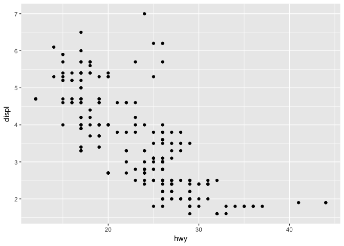
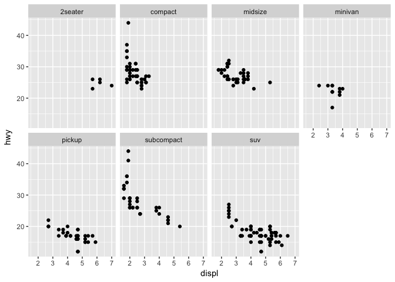
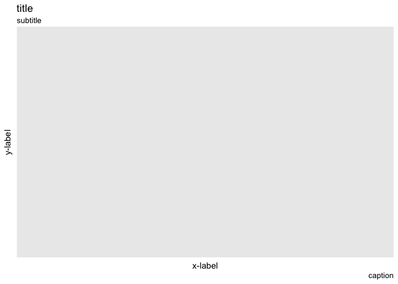

Data visualisation with ggplot2
-------------------------------

This is the first of a five part series summarsing what I've learned
while working through Hadley Wickham's R for Data Science:
<http://r4ds.had.co.nz/>.

I'd recommend Hadley's book as an excellent and most comprehensive
introduction to R programming. Data visualisation is the first concept
he introduces in the text. Data visualisation is incorporated throughout
the entirety of R4DS, however it's most heavily covered in chapters 3,
7, and 28. The goal of this write up is to create a consise data
visualisation reference guide based the concepts in these chapters.

 

#### Other Useful References

R Graphics ggplot2 Cookbook - <http://www.cookbook-r.com/Graphs/>  
Top 50 Visualizations -
<http://r-statistics.co/Top50-Ggplot2-Visualizations-MasterList-R-Code.html>  
R Studio's ggplot2 Cheat Sheet -
<https://www.rstudio.com/wp-content/uploads/2015/03/ggplot2-cheatsheet.pdf>  
Hadley's ggplot2 book (amazon) -
<https://www.amazon.com/dp/331924275X/ref=cm_sw_su_dp>

 

#### Associated Libraries

    library('tidyverse')
    library('ggplot2')
    library('RColorBrewer')
    library('maps')

Be sure to install the packages on your computer using
"install.packages('library\_name')" before calling them with the library
function. Tidyverse is an umbrella package that includes associated
Hadley Wickham data science packages such as dplyr, tidyr, readr, etc.
If you call for the tidyverse package, it is unnecessary to call again
for the ggplot2 package. RColorBrewer provides easy access to an
assortment of excellent color palettes. The maps package allows for
simple geospatial plots of a select number of countries, including the
continental United States.

 

#### Basic Template

    ggplot( < enter data here > ) +            
    geom_< enter geometry here >(              
      mapping = aes( < enter variables here > ),    
      stat = < enter statistical transformations here >,          
      position = < enter position adjustments here >        
    ) + 
    coord_< enter coordinate system here >() +          
    facet_< enter facet system here >()              

The basic idea here is that you can create and describe any possible
graph with these seven parameters. I'll go through the most useful
options for each of the necessary parameters, as well as the optional
parameters that alter other aestetics like the legend and axes.

 

#### ggplot

    ggplot(mpg)

As you can see, entering a dataset into the ggplot function isn't enough
to produce a graph. ggplot() simply produces the base layer of the plot,
you must specify geometry, mapping, aestetics, and so on to actually
produce a plot. use 'ggplot() +' to link the base layer to these
necissary specifications.

 

#### Geometry

    ggplot(mpg) +
      geom_point(mapping = aes(x = displ, y = hwy))

the geom\_( ) function does the majority of the grunt work in ggplot2.
There are two necissary choices to be made with this function, choosing
a geometry, and choosing the mappable variables. Additional commands are
included within the geom( ) call, including aestetic specifications,
statistical transformations, and position adjustments.

##### Geometries

-   **geom\_density( )** - 1 variable gaussian distribution
-   **geom\_point( )** - 2, 3, or 4 variable scatterplot
-   **geom\_smooth( )** - 2 or 3 variable line plot
-   **geom\_bar(stat="identity")** - 2 or 3 variable bar plot
-   **geom\_hex( )** - 2 variable distribution
-   **geom\_tile( )** - 3 variable tile plot
-   **geom\_map( )** - 2, 3, or 4 variable geospatial

##### Mappings

-   **aes( x = )** - x-variable
-   **aes( ..., y = )** - y-variable
-   **aes( ..., color / fill = )** typically a third or fourth variable
-   **aes( ..., size = )** typically a third or fourth variable

##### Aestetics

-   **size =** double (in millimeters)
-   **linetype =** 0 (blank), 1 (solid), 1 (dashed), 3 (dotted), 4
    (dot-dash), 5 (long-dash), 6 (two-dash)
-   **weight =** (line thickness) double
-   **color =** (outline) string
-   **fill =** (inside) string
-   **alpha =** (transparency) 0-1

 

#### Statistical Transformations

Sometimes you want to visualize a transformed version of the original
data. My most commonly used statistcal transformation is identity, use
this transformation with geom\_bar to visualize a variable instead of a
count.

-   **geom\_(aes(...), stat = "count")** - visualise the number of
    entires in a variable, n()  
-   **geom\_(aes(...), stat = "identity")** - visuaise the variable, not
    the count  
-   **geom\_(aes(...), stat = "unique")** - visualise only unique
    components of the variable

 

#### Position Adjustments

When geometric data occupies the same space, it is useful to use a
position adjustment to better understand the visualisation.

-   **geom\_point(aes(...), position = "jitter")** - adds a small amount
    of noise to better view overlapping points  
-   **geom\_bar(aes(...), position = "dodge")** - arranges bar elements
    side-by-side  
-   **geom\_bar(aes(...), position = "fill")** - arranges bar elements
    on top of each other, normalizing height

 

#### Coordinate Systems

    ggplot(mpg) +
      geom_point(mapping = aes(x = displ, y = hwy)) + 
      coord_flip()  

   
Sometimes it's useful to change the coordinate system in a particular
plot. This will affect the axes and how the data is plotted. I find the
most useful coordinate transformations to be coord\_flip (typically with
bar plots) and coord\_trans (typically with exponential or logarithmic
trends).

-   **coord\_fixed(ratio, xlim, ylim)** - fixing the aspect ratio
    between x and y
-   **coord\_flip(xlim, wlim)** - flipping the axes
-   **coord\_polar(theta, start, direction)** - coverting cartesian to
    polar coordinates
-   **coord\_trans(xtrans, ytrans, limx, limy)** - transform cartesian
    coordiantes, use with log / exponent functions  
-   **coord\_map(projection, orientation, xlim, ylim)** - mapproj
    package projections

#### Facets

    ggplot(data = mpg) + 
      geom_point(mapping = aes(x = displ, y = hwy)) + 
      facet_wrap(~ class, nrow = 2)

Dividing a plot into subplots can be helpful when you want to evaluate a
dataset based on the values of one or more discrete variables.

-   **facet\_grid(x ~ ., labeller, scales)** - facets the display into
    columns based on the given variable and placeholder "."  
-   **facet\_grad(. ~ x, labeller, scales)** - facets the display into
    rows based on the given variable and plcaeholder "."  
-   **facet\_grid(x ~ y, labeller, scales)** - facets the display into
    rows and columns based on the two given variables.  
-   **facet\_wrap(~ x, labeller, scales, nrow, ncol)** - wraps facets
    into a rectangular layout

 

#### Labels

    ggplot(mpg) + 
      labs(
        title = "title", 
        subtitle = "subtitle",
        caption = "caption",
        xlab = "x-label", 
        ylab = "y-label"
      )

Labels are very important for effectively communication within your
visualisation. Any label can contain mathematical formulas by using the
quote( ) function. for more information on this, type ?plotmath into the
R console.

 

#### Annotations

It can be useful to label major compnents and interesting observations
within your visualisation. To add annotations to your plot, call the
geom\_text( ) function and assigne the aes( label = ) to a variable of
interest. I don't particularly care for annotating individual
observations, as I find it clutters the graphic.

-   **geom\_text(aes(label = "text here"), vjust = , hjust = )** -
    places a summary annotation within the graphic, according to vjust
    and hjust  
-   **geom\_hline(yintercept = , size = , color = , linetype)** -
    creates a horizontal reference line through the plot according to
    yintercept  
-   **geom\_vline(xintercept = , size =, color =, linetype =)** -
    creates a verticle reference line through the plot according to
    xintercept  
-   **geom\_rect(aes(xmin = , xmax = , ymin = , ymax = ))** - creates a
    rectangle to box in and highlight interesting data  
-   **geom\_segment(aes(x = , y = , xend = , yend = ,) arrow = )** -
    creates a line segment within the plot, it can be an arrow

 

#### Scales

Scales are automatically set when creating a ggplot, but sometimes it's
useful to alter the color scheme, legend, or axes to better communicate
your visulisation. The naming sceme for scales is scale\_ followed by
the name of the aesthetic then \_, and the name of the scale.

##### Aestetic Names

-   **\_x\_**  
-   **\_y\_**  
-   **\_alpha\_**  
-   **\_color\_**  
-   **\_fill\_**  
-   **\_linetype\_**  
-   **\_shape\_**  
-   **\_size\_**

##### Scale Names

-   **\_discrete** - maps discrete variables to visual values  
-   **\_continous** - maps continuous variables to visual values
-   **\_identity** - uses data values as visual values
-   **\_manual** - values = c( ), maps discrete values to manually chose
    visual values
-   **\_gradient** - creates a two color gradient, low - high
-   **\_gradient2** - creates a diverging two color gradient, positive -
    negative
-   **\_gray** -creates a gradient in gray
-   **\_brewer** - brewer( palette = " "), calls RColorBrewer palettes

##### Axes

It's pretty easy to alter axes in ggplot2. Here are some commented
examples for common problems:

    scale_x_continuous(breaks = seq(0, 10, by = 1), labels = c(1:9, "ten"))  # define breaks by sequence, define labels of breaks

    scale_x_discrete(breaks=c("ctrl", "trt1", "trt2"),            # defined tick marks
                     labels=c("Control", "Treat 1", "Treat 2"))   # new names
                     
    expand_limits(x = c(0,8), y = c(0,8))                         # expand the limits of the graph to visualise specific values

    scale_y_reverse()     # Reverse y-axis direction (zero on top)

    element_blank()       # Hiding axis labels 

    theme(axis.title.x = element_text(face="bold", color="red", size=20),  # change axis labels, font and style
          axis.text.x = element_text(angle=90, vjust=0.5, size=16))        # change tick mark label, font, style

    theme(panel.grid.major=element_blank(),  # hiding major gridlines
          panel.grid.minor=element_blank())  # hiding minor gridlines

    library(scales)   # changing the y-axis to log 10
    scale_y_log10(breaks = trans_breaks("log10", function(x) 10^x),
                  labels = trans_format("log10", math_format(10^.x)))

##### Legends

Legends can be a bit harder to wrangle. Here are examples to several
common problems I have with legends.

Controlling the position, or existance of the legend

    theme(legend.position = "left")
    theme(legend.position = "top")
    theme(legend.position = "bottom")
    theme(legend.position = "right") # the default

    theme(legend.position = "none") # no legend will be generated

    geom_point(aes(...), show.legend=FALSE) # don't include this geom in the legend    

Hiding the legend's title

    theme(legend.title = element_blank())

Changing the order of items in your legend. Declare the scale\_ function
based on your plot, use guides = for a simple reverse

    scale_fill_discrete(breaks=(c("item1", "item2", "item3")))

    scale_fill_discrete(guide = guide_legend(reverse=TRUE))

Manually alter the color, breaks, labels, and names of your legend,
again the scale\_ function is based on your plot

    scale_fill_manual(values=c("#999999", "#E69F00", "#56B4E9"), 
                      name="Experimental\nCondition",
                      breaks=c("ctrl", "trt1", "trt2"),
                      labels=c("Control", "Treatment 1", "Treatment 2"))

##### Colors

Some of my favorite preset colors include

-   thistle
-   slateblue2
-   orchid
-   midnightblue
-   deepskyblue
-   lightslateblue

The RColorBrewer package also has pleasing palettes

    RColorBrewer::display.brewer.all()

#### Themes

Sometimes you don't want to go through the effort of creating your own
theme, so ggplot2 has built in themes to change it up a little bit.
There are many expansions created for ggplot2 themes, but heres four of
the most popular base ggplot2 themes.

-   **theme\_bw()** - A while background with gridlines
-   **theme\_grey()** - the default theme
-   **theme\_classic()** - A white background with no gridlines
-   **theme\_minimal()** - mystery theme, check it out!

#### Summary
